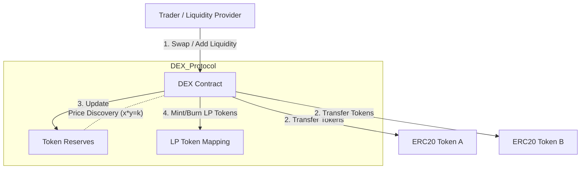
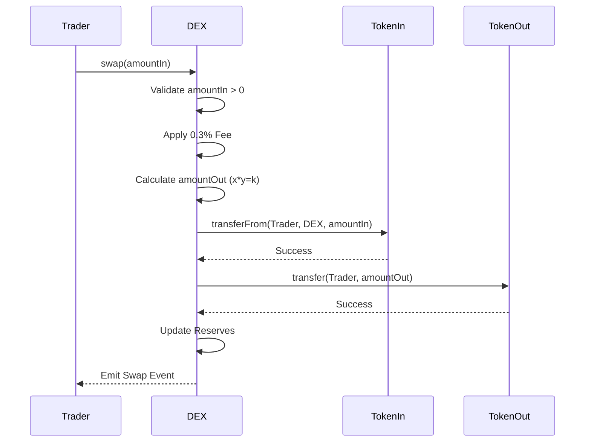

# DEX AMM Project

## Overview

This project implements a simplified Decentralized Exchange (DEX) using the Automated Market Maker (AMM) model, similar to Uniswap V2. The DEX enables permissionless, non-custodial trading of ERC-20 tokens using liquidity pools and the constant product formula.

## Features

- **Initial and subsequent liquidity provision**: First provider sets the price ratio; subsequent providers must match it
- **Liquidity removal with proportional share calculation**: LP tokens represent ownership and can be burned to withdraw assets
- **Token swaps using constant product formula (x * y = k)**: Automated price discovery based on pool reserves
- **0.3% trading fee for liquidity providers**: Fees accumulate in the pool, increasing LP value over time
- **LP token minting and burning**: Integrated LP token system using mappings for gas efficiency

## Architecture

### Contract Structure

The project consists of two main smart contracts:

1. **DEX.sol**: Core AMM implementation
   - Manages liquidity pools for token pairs
   - Implements constant product formula for swaps
   - Handles LP token minting/burning via mappings
   - Includes reentrancy protection and safe token transfers

### System Interaction Architecture



2. **MockERC20.sol**: Test token implementation
   - Standard ERC-20 token for testing
   - Includes public mint function for test flexibility

### Key Design Decisions

- **Integrated LP Tokens**: LP tokens are managed via a mapping rather than a separate ERC-20 contract for simplicity and gas efficiency
- **Reserve Tracking**: Reserves are stored as state variables rather than using `balanceOf()` to prevent manipulation via direct transfers
- **Fee Mechanism**: 0.3% fee is deducted from input amount before applying the constant product formula
- **Security**: Uses OpenZeppelin's ReentrancyGuard and SafeERC20 for secure token operations

## Mathematical Implementation

### Constant Product Formula

The core invariant of the AMM is: **x * y = k**

Where:
- `x` = reserve of Token A
- `y` = reserve of Token B
- `k` = constant product

**Without fees**: After a swap, k remains constant
**With 0.3% fee**: k slightly increases with each trade, benefiting liquidity providers

### Fee Calculation

For a swap with input amount `amountIn`:

```solidity
amountInWithFee = amountIn * 997
numerator = amountInWithFee * reserveOut
denominator = (reserveIn * 1000) + amountInWithFee
amountOut = numerator / denominator
```

### Swap Execution Flow


### Liquidity Provision Logic
```mermaid
flowchart LR
    Start([Add Liquidity]) --> ResCheck{Reserves > 0?}
    ResCheck -- No (First LP) --> CalcSQRT[Liquidity = sqrt(A*B)]
    ResCheck -- Yes --> RatioCheck[Check Price Ratio]
    RatioCheck --> CalcProp[Liquidity = (A * TotalSupply) / ReserveA]
    CalcSQRT --> Mint[Mint LP Tokens]
    CalcProp --> Mint
    Mint --> Updateres[Update Reserves]
    Updateres --> End([Done])
```

This ensures:
- 0.3% of input stays in pool (997/1000 = 99.7%)
- Fee compounds over time
- LPs earn proportional to their share

### LP Token Minting

**Initial Liquidity (First Provider):**
```
liquidityMinted = sqrt(amountA * amountB)
```

This geometric mean ensures the initial LP token supply is independent of the initial price ratio.

**Subsequent Liquidity Addition:**
```
liquidityMinted = (amountA * totalLiquidity) / reserveA
```

LP tokens are minted proportionally to maintain fair distribution.

**Liquidity Removal:**
```
amountA = (liquidityBurned * reserveA) / totalLiquidity
amountB = (liquidityBurned * reserveB) / totalLiquidity
```

Users receive a proportional share of both tokens based on their LP token percentage.

## Setup Instructions

### Prerequisites

- Docker and Docker Compose installed
- Git

### Installation

1. **Clone the repository:**
```bash
git clone <your-repo-url>
cd dex-amm
```

2. **Start Docker environment:**
```bash
docker-compose up -d
```

3. **Compile contracts:**
```bash
docker-compose exec app npm run compile
```

4. **Run tests:**
```bash
docker-compose exec app npm test
```

5. **Check coverage:**
```bash
docker-compose exec app npm run coverage
```

6. **Stop Docker:**
```bash
docker-compose down
```

## Running Tests Locally (without Docker)

```bash
npm install
npm run compile
npm test
```

## Test Suite

The project includes 27 comprehensive test cases covering:

- **Liquidity Management (8 tests)**
  - Initial and subsequent liquidity provision
  - LP token minting calculations
  - Liquidity removal
  - Error handling

- **Token Swaps (8 tests)**
  - Bidirectional swaps (A→B, B→A)
  - Fee calculation accuracy
  - Reserve updates
  - Constant product verification
  - Edge cases

- **Price Calculations (3 tests)**
  - Initial price setting
  - Price updates after swaps
  - Zero reserve handling

- **Fee Distribution (2 tests)**
  - Fee accumulation
  - Proportional distribution

- **Edge Cases (3 tests)**
  - Very small/large amounts
  - Unauthorized access prevention

- **Events (3 tests)**
  - Proper event emission

## Contract Addresses

*Contracts are currently deployed on Hardhat local network for testing. For testnet deployment, run:*

```bash
npx hardhat run scripts/deploy.js --network <network-name>
```

## Known Limitations

1. **Single Trading Pair**: Current implementation supports only one token pair per DEX instance
2. **No Slippage Protection**: Users should implement slippage checks in their frontend
3. **No Deadline Parameter**: Transactions don't have time-bound execution
4. **Ratio Enforcement**: Subsequent liquidity providers must provide exact ratio (no automatic optimization)
5. **Minimum Liquidity**: Very small liquidity amounts may result in rounding issues

## Security Considerations

### Implemented Security Measures

1. **ReentrancyGuard**: All state-changing functions are protected against reentrancy attacks
2. **SafeERC20**: Uses OpenZeppelin's SafeERC20 for secure token transfers
3. **Input Validation**: All functions validate inputs (non-zero amounts, sufficient balances)
4. **Overflow Protection**: Solidity 0.8.19 provides automatic overflow/underflow protection
5. **Reserve Tracking**: Reserves are tracked separately from balances to prevent manipulation

### Recommendations for Production

1. **Professional Audit**: Conduct a thorough security audit before mainnet deployment
2. **Additional Features**: Implement slippage protection and deadline parameters
3. **Gas Optimization**: Further optimize for gas efficiency
4. **Emergency Pause**: Add circuit breaker functionality
5. **Upgrade Mechanism**: Consider proxy pattern for upgradeability
6. **Flash Loan Protection**: Implement additional checks for flash loan attacks

## Mathematical Verification

### Constant Product Invariant

After each swap, the product k should increase slightly due to fees:

```
k_before = reserveA * reserveB
k_after = reserveA_new * reserveB_new
k_after >= k_before (strictly greater due to 0.3% fee)
```

### LP Token Fairness

The sum of all LP tokens should always equal totalLiquidity:

```
sum(liquidity[all_addresses]) = totalLiquidity
```

### Proportional Withdrawal

When removing liquidity, users receive exactly their proportional share:

```
userShare = userLiquidity / totalLiquidity
amountA_received = userShare * reserveA
amountB_received = userShare * reserveB
```

## Development

### Project Structure

```
dex-amm/
├── contracts/
│   ├── DEX.sol              # Core AMM implementation
│   └── MockERC20.sol        # Test ERC-20 token
├── test/
│   └── DEX.test.js          # Comprehensive test suite
├── scripts/
│   └── deploy.js            # Deployment script
├── Dockerfile               # Docker configuration
├── docker-compose.yml       # Docker Compose setup
├── .dockerignore           # Docker ignore file
├── .gitignore              # Git ignore file
├── hardhat.config.js       # Hardhat configuration
├── package.json            # NPM dependencies
└── README.md               # This file
```

### Available Scripts

- `npm run compile` - Compile smart contracts
- `npm test` - Run test suite
- `npm run coverage` - Generate code coverage report
- `npm run deploy` - Deploy contracts to configured network

## License

MIT

## Contributing

Contributions are welcome! Please ensure all tests pass and maintain code coverage above 80%.

## Acknowledgments

- Inspired by Uniswap V2
- Built with Hardhat and OpenZeppelin contracts
- Educational project for understanding AMM mechanics
