# 🦄 Decentralized Exchange (DEX) AMM Protocol


## 🌟 Overview

This project implements a **fully functional Decentralized Exchange (DEX)** using the **Automated Market Maker (AMM)** model, inspired by **Uniswap V2**. It enables permissionless, non-custodial trading of ERC-20 tokens through liquidity pools and the constant product formula (`x * y = k`).

> **Features at a Glance:**
> *   🚀 **Swap**: Instant token swaps with automated price discovery.
> *   💧 **Liquidity**: Seamless provision and withdrawal with LP tokens.
> *   💸 **Fees**: 0.3% trading fee distributed to liquidity providers.
> *   🛡️ **Security**: Reentrancy protection and safe transfer implementations.
> *   📊 **Visualization**: Built-in script to simulate live trading in the terminal.

---

## 🏗️ Architecture & Design

### Contract Structure

The core logic is split into two robust smart contracts:

1.  **`DEX.sol`** (Core Protocol)
    *   **Market Making**: Implements the `x * y = k` invariant.
    *   **LP Management**: Mints/burns LP tokens using an optimized internal mapping system.
    *   **Safety**: Guards against reentrancy and token transfer failures.

2.  **`MockERC20.sol`** (Testing)
    *   **Flexibility**: Allows minting tokens on demand for comprehensive test scenarios.

### System Interaction Diagram

```mermaid
graph TD
    User[👤 Trader / LP]
    subgraph "⛓️ DEX Protocol"
        DEX[⚙️ DEX Contract]
        Reserves[💰 Token Reserves]
        LPM[🎫 LP Token Ledger]
    end
    TokenA[🪙 Token A]
    TokenB[🪙 Token B]

    User -- "1. Swap / Add Liq" --> DEX
    DEX -- "2. Transfer Tokens" --> TokenA
    DEX -- "2. Transfer Tokens" --> TokenB
    DEX -- "3. Update State" --> Reserves
    DEX -- "4. Mint/Burn LP" --> LPM
    Reserves -. "Price Discovery (x*y=k)" .- DEX
    
    style DEX fill:#f9f,stroke:#333,stroke-width:2px
    style User fill:#ccf,stroke:#333,stroke-width:2px
```



---

## 🧮 Mathematical Model

### The Constant Product Formula
The AMM relies on the invariant:
$$x \times y = k$$

*   **x**: Reserve of Token A
*   **y**: Reserve of Token B
*   **k**: Constant product (increases only when liquidity is added or fees accumulate)

### Fee Mechanism & Swaps
Every trade pays a **0.3% fee**, which is added to the reserves, rewarding Liquidity Providers (LPs).

**Swap Logic Flow:**

```mermaid
sequenceDiagram
    participant T as 👤 Trader
    participant D as ⚙️ DEX
    participant TA as 🪙 Token A
    participant TB as 🪙 Token B
    
    Note over T, D: User initiates Swap (A for B)
    T->>D: swapAForB(amountIn)
    activate D
    D->>D: Validate & Calc Fee (0.3%)
    D->>D: Calc AmountOut (x*y=k)
    D->>TA: transferFrom(User, DEX, amountIn)
    TA-->>D: ✅ Success
    D->>TB: transfer(User, amountOut)
    TB-->>D: ✅ Success
    D->>D: Update Reserves
    D-->>T: 📢 Emit Swap Event
    deactivate D
```


---

## 🚀 Getting Started

### Prerequisites
*   Docker & Docker Compose (Recommended)
*   Node.js & NPM (For local debugging)

### 📦 Installation

1.  **Clone the repository:**
    ```bash
    git clone https://github.com/shahanth4444/dex-amm.git
    cd dex-amm
    ```

2.  **Start the environment:**
    ```bash
    docker-compose up -d
    ```

---

## 🛠️ Usage & Verification

### 1. Run the Simulation 🎮
See the DEX in action right in your terminal! This script deploys contracts, adds liquidity, and executes trades to demonstrate functionality visually.

```bash
docker-compose exec app npx hardhat run scripts/simulate.js
```

### 2. Run Tests 🧪
Execute the comprehensive test suite comprising **35 test cases**.

```bash
docker-compose exec app npm test
```

### 3. Check Coverage 📊
Verify that the codebase is fully tested (100% target).

```bash
docker-compose exec app npm run coverage
```

---

## 🧪 Test Suite Coverage

The project maintains **100% Code Coverage** across **35 Test Cases**:

*   ✅ **Liquidity Management**: Adding/Removing liquidity, ratio enforcement.
*   ✅ **Swaps**: Bidirectional swaps, fee accuracy, price impact.
*   ✅ **Price Mechanics**: Correctness of `x*y=k` after trades.
*   ✅ **Edge Cases**: Zero amounts, pool draining, small/large values.
*   ✅ **Security**: Reentrancy checks, unauthorized access prevention.
*   ✅ **Constructor**: Initialization validation.

---

## 📂 Project Structure

```
dex-amm/
├── 📂 contracts/        # Smart Contracts source code
│   ├── DEX.sol
│   └── MockERC20.sol
├── 📂 test/             # Hardhat Test Suite (35 tests)
├── 📂 scripts/          # Deployment & Simulation scripts
│   ├── deploy.js
│   └── simulate.js      # <--- VISUAL SIMULATION
├── 🐳 Dockerfile        # Container definition
├── 📄 docker-compose.yml
├── ⚙️ hardhat.config.js # Network configuration
└── 📝 README.md         # Project documentation
```

---

## 🛡️ Security Measures

*   **ReentrancyGuard**: Prevents re-entrancy attacks on all state-changing functions.
*   **SafeERC20**: Mitigates non-standard ERC20 token behavior.
*   **Separate Reserve Tracking**: Prevents manipulation via direct token transfers (balance vs reserve check).
*   **Solidity 0.8.x**: Built-in overflow/underflow protection.

---
